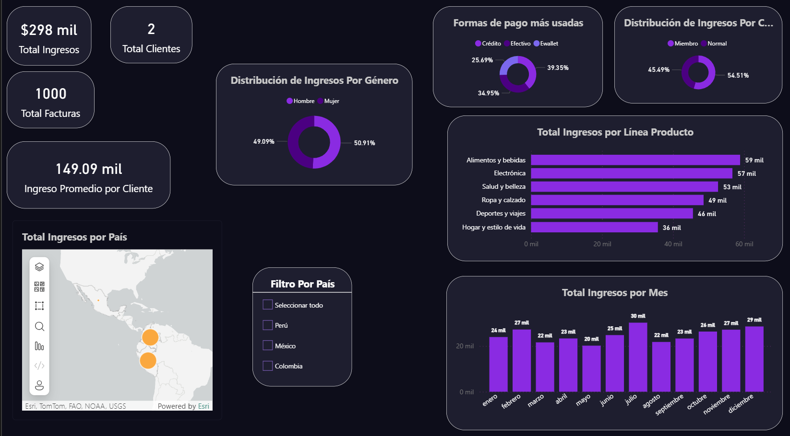
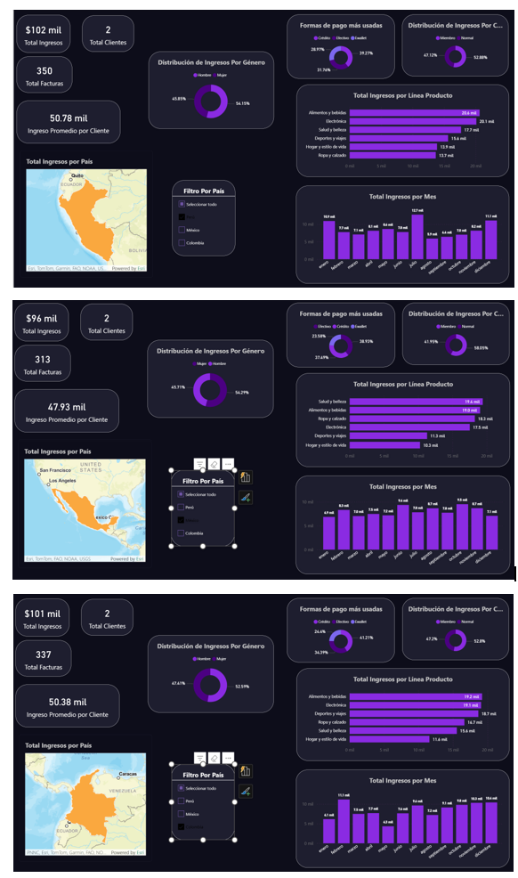
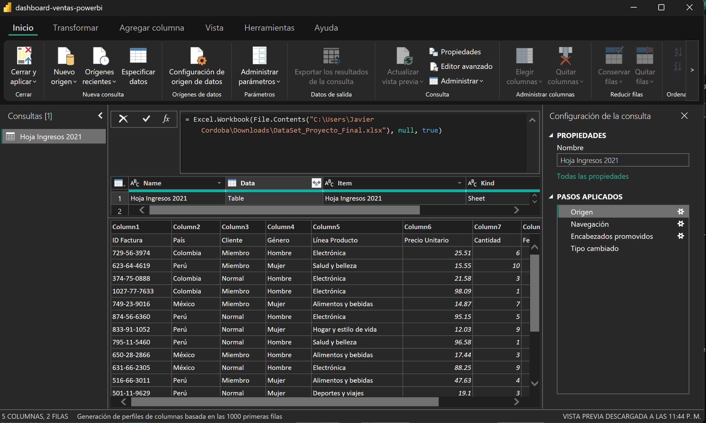
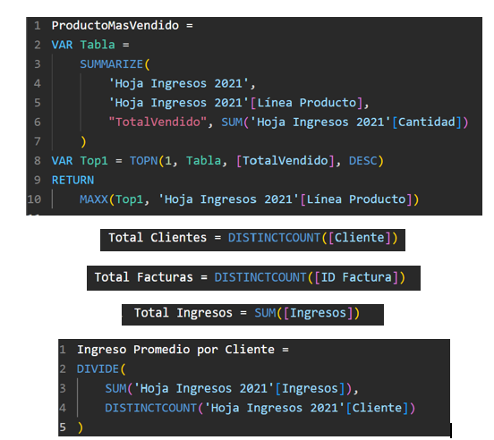
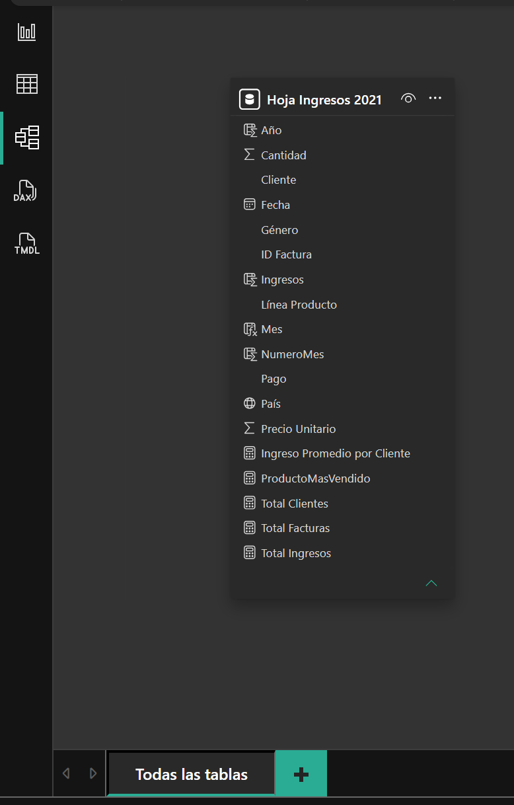

  

<h1 align="center"> Dashboard Ejecutivo de Ventas</h1>

Power BI • DAX • Power Query • Business Intelligence

---

## Descripción

Dashboard interactivo desarrollado en Power BI para analizar ingresos, clientes, facturación, productos, métodos de pago y distribución geográfica de ventas.

El objetivo es proporcionar indicadores clave de negocio (KPIs) para apoyar la toma de decisiones mediante visualizaciones dinámicas y análisis de datos.

---

## Tecnologías Utilizadas

* Power BI
* DAX
* Power Query
* Excel
* Business Intelligence

---

## KPIs Implementados

* Total Ingresos
* Total Clientes
* Total Facturas
* Ingreso Promedio por Cliente
* Ingresos por País
* Ingresos por Mes
* Ingresos por Línea de Producto

---

## Dashboard Principal

---

## Análisis Geográfico

---

## Proceso ETL con Power Query

---

## Medidas DAX

---

## Modelo de Datos

---

## Aprendizajes

Durante este proyecto reforcé habilidades en:

* Transformación de datos (ETL)
* Creación de KPIs
* Modelado de datos
* Visualización ejecutiva
* Desarrollo de medidas DAX
* Business Intelligence

---

## Autor

Francisco Javier Cordoba Tufiño

Estudiante de Ingeniería de Software
Universidad Autónoma de Querétaro
